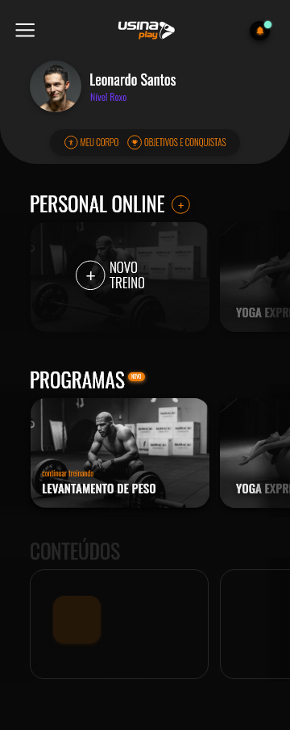

<h1 align="center">
  Ionic App
</h1>

  <a href="#-tecnologias">Tecnologias</a>&nbsp;&nbsp;&nbsp;|&nbsp;&nbsp;&nbsp;
  <a href="#-projeto">Projeto</a>&nbsp;&nbsp;&nbsp;|&nbsp;&nbsp;&nbsp;
  <a href="#-layout">Layout</a>&nbsp;&nbsp;&nbsp;|&nbsp;&nbsp;&nbsp;
  <a href="#-como-executar">Como executar</a>&nbsp;&nbsp;&nbsp;|&nbsp;&nbsp;&nbsp;
  <a href="#-executando-a-aplicação">Executando a aplicação</a>

## 🚀 Tecnologias

Esse projeto foi desenvolvido com as seguintes tecnologias:

- [Ionic](https://ionicframework.com/)    
  
- [Angular](https://angular.dev/)    

- [Firebase](https://firebase.google.com/)    

## 💻 Projeto

Esse projeto é um desafio requerido pela empresa Be220, com o objetivo de demonstrar habilidades em desenvolvimento de aplicativos utilizando o framework Ionic e Firebase. O aplicativo é focado em criar uma plataforma de treinamento personalizada, onde cada usuário pode cadastrar e gerenciar seus próprios treinos.

## ✨ Layout

  

## 🔖 Como executar

- Clone o repositório
- Instale as dependências com `npm i`
- Configure as variáveis de ambiente do firebase adicionando o objeto `firebaseConfig` no arquivo `environment.ts` e configurando o Firebase Authentication e Firestore Database
- Inicie o servidor com `ionic serve`

Agora você pode acessar [`localhost:8100`](http://localhost:8100) do seu navegador.

## 🎬 Executando a aplicação

  

